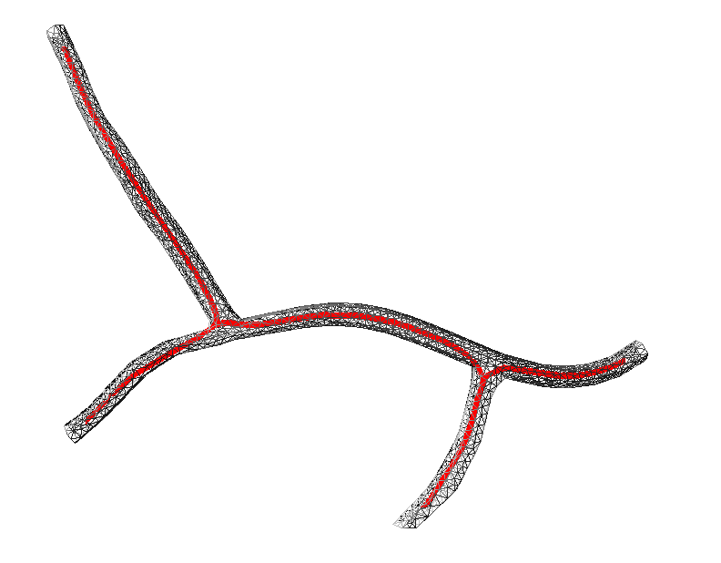

# MeshSkeletonization plugin

This plugin interfaces [CGAL Skeletonization](https://doc.cgal.org/latest/Surface_mesh_skeletonization/index.html) with [SOFA Framework](https://www.sofa-framework.org/). Given a triangulated surface mesh, it outputs in a file a set of points representing the skeleton of the mesh. The skeleton is splited per polyline allowing to identify biforcation in case they exist. 


## Build

The build can be done In-tree or Out of tree, see SOFA  [documentation](https://www.sofa-framework.org/community/doc/plugins/build-a-plugin-from-sources/).

- CGAL version needed should be greater than 4.9
- SOFA version compatible since v22.06 


## Usage

The example bellow store in the output file the skeleton of a the input vessel mesh. 
```xml
<Node name="root" dt="0.01" gravity="0 -1 0">
    <VisualStyle displayFlags="showVisual showCollisionModels showWireframe"/>
    <RequiredPlugin name="Sofa.GL.Component.Rendering3D"/> <!-- Needed to use components [OglModel] -->
    <RequiredPlugin name="Sofa.Component.Visual"/> <!-- Needed to use components [VisualStyle] -->
    <RequiredPlugin name="Sofa.Component.SceneUtility"/> <!-- Needed to use components [InfoComponent] -->
    <RequiredPlugin name="Sofa.Component.IO.Mesh"/> <!-- Needed to use components [MeshOBJLoader] -->
    <RequiredPlugin name="MeshSkeletonizationPlugin"/>
    
    <DefaultAnimationLoop />
    <MeshOBJLoader name="meshLoader" filename="../data/mesh/vessels.obj" />

    <MeshSkeletonization template="Vec3d" name="skeleton"
                    inputVertices="@meshLoader.position" inputTriangles="@meshLoader.triangles"
                    outputSkeleton="../data/skeletons/output_vessels_skeleton.txt"
                    />
    
    <Node name="visual">
        <OglModel src="@../meshLoader"/>
    </Node>
    
</Node>
```

It is important to specify the Data ```outputSkeleton``` in which the plugin will write the centerlines. 

This file will contain a set of points per polyline, polylines are separated by an empty line. Biforcation points can be found on their corresponant polylines.

Please note that the plugin is compatible with [SOFAPython3](https://sofapython3.readthedocs.io/en/latest/)

The scene above visualusation: 


Other examples can be found in the *scenes* directory

## AUTHOR :
 - Nazim Haouchine
 - Sidaty El Hadramy

## Contributing
Pull requests are welcome. For major changes, please open an issue first to discuss what you would like to change.

Please make sure to update tests as appropriate.
